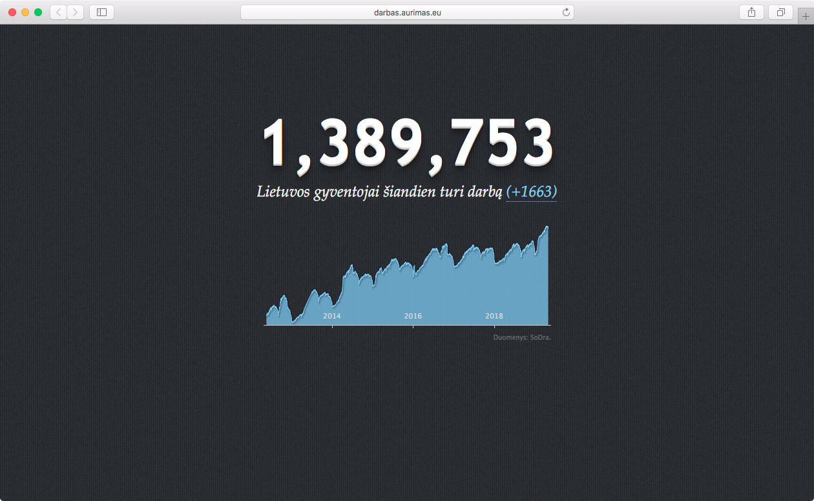

# Darbas

We have always been fans of the idea behind open data, and we were a bit envious about all the developments in the UK and the USA, with dedicated government portals popping up with loads of datasets. So when the [Lithuanian Social Insurance Fund](http://www.sodra.lt/en) started publishing daily statistics on the number of insured policyholders (effectively, all working people), we jumped at the opportunity to save that data and do something with it.

For the moment, this project does two things:
+ saves the daily statistics to a database (statistics comprise a count of workers insured by an insurer (usually, an enterprise, with its VAT payee code provided, too))
+ shows a total Lithuanian "employment" chart, so you can enjoy a near-real-time pulse of the Lithuanian economy.

## Code

A bit of [Bootstrap](http://twitter.github.io/bootstrap/) and [Highcharts](http://www.highcharts.com/) for the frontend. PHP and Python for the backend.

## Installation

+ You need to provide your database credentials and some other information in settings/settings.ini. A sample settings file is provided under the same folder.
+ The collection of data is done by running a python script 'backend/sodra.py'. It will also create the necessary table structure in MySQL during the first run.
+ The statistics are published daily, around 17:00 Lithuanian time (GMT + 3). We suggest running a cron on the python script twice daily (around 17:00 and in the morning, around 9:00), in case the statistics are published late.

## Authors
**Ernesta Orlovaitė**

+ [ernes7a.lt](http://ernes7a.lt)
+ [@ernes7a](http://twitter.com/ernes7a)

**Aurimas Račas**

+ [aurimas.eu](http://aurimas.eu)
+ [@Aurimas](http://twitter.com/aurimas)

## Screenshot
 
